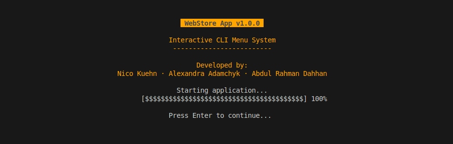

# WebStore App

A comprehensive e-commerce backend system with a CLI interface, featuring user management, product catalog, order processing, and secure payment integration.

## Overview

This project combines a powerful backend API with an interactive CLI interface for managing an e-commerce platform. It provides a complete solution for both administrators and customers, with features ranging from user authentication to order processing.



*Screenshot: WebStore App Interface with orange-themed navigation and product management*

## Key Features

### User Management & Authentication
- Secure user registration and login system
- Role-based authorization (Admin/Customer)
- Password hashing and security
- Session management

### Product Management
- Comprehensive product catalog
- Category-based organization
- Inventory tracking
- Product search and filtering

### Shopping Experience
- Interactive cart management
- Secure checkout process
- Order history tracking
- Enhanced discount system
- Tax calculation
- Multi-tiered pricing

### Admin Interface
- Product management dashboard
- User management
- Inventory control
- Sales monitoring
- System configuration

### Security Features
- Secure authentication
- Input validation
- Data sanitization
- Error handling
- Session management

## Requirements

- Python 3.6 or higher
- Virtual environment (created automatically)
- Required packages (installed automatically):
  - blessed
  - wcwidth

## Technical Stack

### Backend Core
- Python 3.6+
- Virtual Environment
- JSON-based data storage
- MVC architecture

### User Interface
- Blessed terminal interface
- Interactive menus
- Color-coded UI elements
- Progress indicators
- Responsive terminal layouts

### Dependencies
- blessed: Terminal interface
- wcwidth: Terminal formatting

## Installation

1. Clone the repository:
   ```bash
   git clone https://github.com/nicokuehn-dci/webstore_backend.git
   cd webstore-app
   ```

2. Run the application:
   ```
   ./webstore.py
   ```

The application will automatically:
- Check for and create a `requirements.txt` file if needed
- Check for and create a `.gitignore` file if needed
- Set up a virtual environment if needed
- Install required packages if needed

## Usage

### Command-line options

```
./webstore.py [options]

Options:
  -h, --help     Show help message and exit
  -v, --version  Show version and exit
  --init         Initialize repository with requirements.txt and .gitignore
```

### User types

1. **Regular users** can:
   - Browse products by category
   - Search for products
   - Add products to cart
   - View and manage their cart
   - Checkout

2. **Admin users** can:
   - Add new products
   - Delete existing products
   - List products by category
   - Update product details

## Project Structure

```
webstore-app/
├── webstore.py           # Application entry point
├── requirements.txt      # Python dependencies
├── data/                 # Data storage
│   ├── products.json
│   ├── users.json
│   └── admins.json
├── src/
│   ├── controllers/      # Business logic
│   │   ├── auth_controller.py
│   │   ├── cart_controller.py
│   │   ├── main_controller.py
│   │   └── product_controller.py
│   ├── models/          # Data models
│   │   ├── cart.py
│   │   ├── product.py
│   │   └── user.py
│   ├── views/          # User interface
│   │   ├── admin_view.py
│   │   ├── customer_view.py
│   │   └── menu.py
│   └── utils/         # Utilities
│       └── setup.py
└── docs/             # Documentation
    └── handbook.md
```

## Development

### Code Organization
- MVC architecture
- Modular design
- Clear separation of concerns
- Extensible structure

### Best Practices
- PEP 8 compliance
- Comprehensive error handling
- Input validation
- Secure data management

## Contributors

- Nico Kuehn (<nico.kuehn@dci.education>)
- Alexandra Adamchyk (<alexandra.adamchyk@dci.education>)
- Abdul Rahman Dahhan (<abdul.dahhan@dci.education>)

## Recent Enhancements
- Enhanced cart functionality with tax calculation
- Improved virtual environment handling
- Added full-featured product management
- Implemented hierarchical menu navigation
- Enhanced user authentication system

## License

This project is licensed under the MIT License - see the LICENSE file for details.

---

© 2025 WebStore App Team. All rights reserved.
