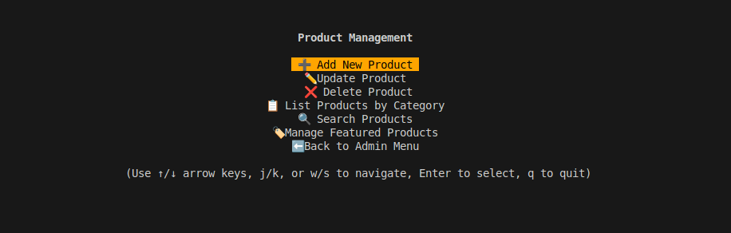

# WebStore App

A Python-based command-line interface (CLI) e-commerce application featuring an interactive menu system, comprehensive product management, and secure user authentication.

## Overview

This project implements a feature-rich e-commerce platform using Python's blessed library for terminal UI. It provides an intuitive, color-coded interface with smooth navigation, real-time cart management, and a sophisticated product catalog system. The application uses JSON-based data storage for maintaining user, product, and transaction data.

## Application Screenshots

### Main Interface

*Main Interface with orange-themed navigation*

## Key Features

### User Management & Authentication
- Secure user registration and login system
- Role-based authorization (Admin/Customer)
- Password hashing and security
- Session management


### Product Management
- Comprehensive product catalog
- Category-based organization
- Inventory tracking
- Product search and filtering


#### Product Management

*Administrative in

### Shopping Experience
- Interactive cart management
- Secure checkout process

#### Checkout Process

*Streamlined checkout process with order summary*

- Order history tracking
- Enhanced discount system
- Tax calculation
- Multi-tiered pricing

### Admin Interface
- Product management dashboard
- User management
- Inventory control
- Sales monitoring
- System configuration

#### Product Management

*Interactive shopping cart with real-time updates*terface for product management*

### Security Features
- Secure authentication
- Input validation
- Data sanitization
- Error handling
- Session management

## Technical Implementation

### Core Technology
- Python 3.6+ with virtual environment management
- MVC (Model-View-Controller) architecture
- JSON-based persistent storage
- Object-oriented design patterns

### Terminal Interface
- Blessed library for advanced terminal manipulation
- Interactive arrow-key navigation
- Color-coded UI elements (orange theme)
- Dynamic progress indicators
- Responsive terminal layouts
- Real-time display updates

### Dependencies
- blessed: Terminal interface
- wcwidth: Terminal formatting

## Installation

1. Clone the repository:
   ```bash
   git clone https://github.com/nicokuehn-dci/webstore_backend.git
   cd webstore-app
   ```

2. Run the application:
   ```bash
   ./webstore.py
   ```

The application will automatically:
- Check for and create a `requirements.txt` file if needed
- Check for and create a `.gitignore` file if needed
- Set up a virtual environment if needed
- Install required packages if needed

## Usage

### Command-line options

```bash
./webstore.py [options]

Options:
  -h, --help     Show help message and exit
  -v, --version  Show version and exit
  --init         Initialize repository with requirements.txt and .gitignore
```

### User types

1. **Regular users** can:
   - Browse products by category
   - Search for products
   - Add products to cart
   - View and manage their cart
   - Checkout

2. **Admin users** can:
   - Add new products
   - Delete existing products
   - List products by category
   - Update product details

## Project Structure

```
webstore-app/
├── webstore.py           # Application entry point
├── requirements.txt      # Python dependencies
├── data/                 # Data storage
│   ├── products.json
│   ├── users.json
│   └── admins.json
├── src/
│   ├── controllers/      # Business logic
│   │   ├── auth_controller.py
│   │   ├── cart_controller.py
│   │   ├── main_controller.py
│   │   └── product_controller.py
│   ├── models/          # Data models
│   │   ├── cart.py
│   │   ├── product.py
│   │   └── user.py
│   ├── views/          # User interface
│   │   ├── admin_view.py
│   │   ├── customer_view.py
│   │   └── menu.py
│   └── utils/         # Utilities
│       └── setup.py
└── docs/             # Documentation
    └── handbook.md
```

## Development

### Code Organization
- MVC architecture
- Modular design
- Clear separation of concerns
- Extensible structure

### Best Practices
- PEP 8 compliance
- Comprehensive error handling
- Input validation
- Secure data management

## Contributors

- Nico Kuehn (<nico.kuehn@dci.education>)
- Alexandra Adamchyk (<alexandra.adamchyk@dci.education>)
- Abdul Rahman Dahhan (<abdul.dahhan@dci.education>)

## Recent Enhancements
- Enhanced cart functionality with tax calculation
- Improved virtual environment handling
- Added full-featured product management
- Implemented hierarchical menu navigation
- Enhanced user authentication system

## License

This project is licensed under the MIT License - see the LICENSE file for details.

---

© 2025 WebStore App Team. All rights reserved.
